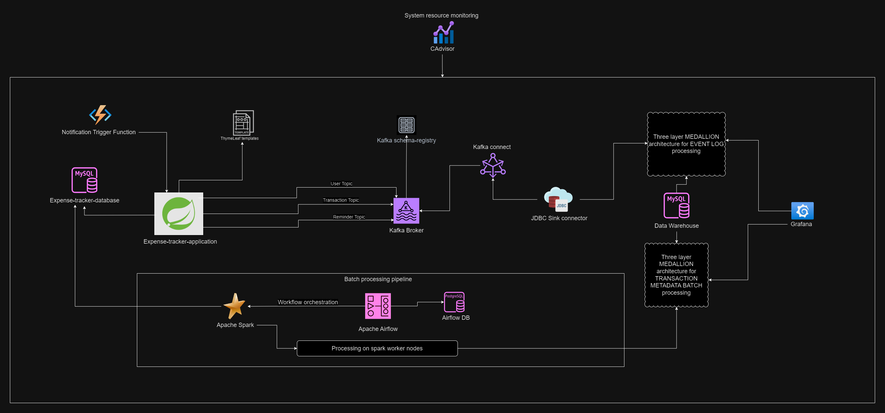
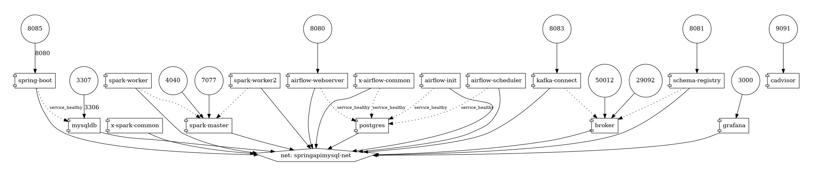

# Expense Tracker Application

## Overview

This project is an **Expense Tracker Application** designed to track user expenses and provide insights using event-driven streaming and batch processing pipelines. The system architecture follows a microservices approach, utilizing a mix of **Kafka** for real-time event streaming, **Apache Airflow** for batch processing, and a **Data Warehouse** using the **Medallion architecture**.

## System Architecture

The architecture of the system is divided into four major components:

- **Spring Boot Backend**: Manages the core application features and user interactions.
- **Kafka Event Streaming**: Handles real-time event processing and logging.
- **Airflow-Spark Batch Processing**: Manages batch processing pipelines and job orchestration.
- **Data Warehouse**: Stores processed data using a three-layer Medallion architecture (Bronze, Silver, Gold).




## Components

### 1. Spring Boot Backend
- **Technologies**: Spring Boot, MySQL, Thymeleaf, JavaMailSender, Azure Functions
- **Features**:
  - A full-featured REST API for managing user expenses.
  - Integrates with Thymeleaf for rendering templates and JavaMailSender for email notifications.
  - Includes job scheduling and custom database queries using the Spring Data Specification interface.
  - Notification system triggered via Azure Functions.

### 2. Kafka Event Streaming
- **Technologies**: Apache Kafka, Kafka Schema Registry, AVRO
- **Features**:
  - Events are produced in real-time from the backend and logged into four Kafka topics: `User`, `Transaction`, `Report` and `Reminder`.
  - Each event is structured using AVRO schemas, validated through the Kafka Schema Registry.
  - Kafka Connect with a JDBC Sink connector moves event data into the data warehouse.

### 3. Apache Airflow Batch Processing
- **Technologies**: Apache Airflow, Apache Spark, PostgreSQL (Airflow metadata DB)
- **Features**:
  - Airflow orchestrates daily batch jobs to process transaction data.
  - Initially used Python scripts and MySQL hooks, but switched to **Apache Spark** for more efficient data processing.
  - Spark processes large volumes of data on worker nodes, producing faster runtimes with higher resource utilization.
  - Batch processing follows the medallion architecture (Bronze, Silver, Gold layers).

### 4. Data Warehouse
- **Technologies**: MySQL, JDBC, SQL Triggers, Procedures
- **Architecture**: Three-layer **Medallion Architecture**
  - **Bronze Layer**: Raw event data is stored as-is from the Kafka event streams and application batches.
  - **Silver Layer**: Data is refined and structured, applying constraints and transforming event metadata into a more usable format.
  - **Gold Layer**: Data is organized into a star schema, making it accessible for analytics and reporting.
  
### 5. Monitoring & Analytics
- **Technologies**: CAdvisor, Grafana
  - **CAdvisor** monitors the performance and resource usage of all Docker containers in the system.
  - **Grafana** dashboards visualize both real-time and batch-processed data:
    - Event log dashboard for real-time streaming analysis.
    - Transaction data dashboard for batch processing insights.

## Setup Instructions

### Prerequisites
- Docker & Docker Compose

### Steps to Run

1. **Clone the repository**:
   ```bash
   git clone https://github.com/your-username/expense-tracker-app.git
   cd expense-tracker-app
   ```

2. **Configure `.env` Files**:
   Update the `.env` file with your environment variables, such as database credentials, Kafka configuration, etc.

3. **Start Docker Compose**:
   Run the following command to start all services:
   ```bash
   docker-compose --env-file dev.env up --build
   ```

4. **Access the Application**:
   - Backend: `http://localhost:8085`
   - Airflow: `http://localhost:8081`
   - Grafana: `http://localhost:3000`
   - CAdvisor: `http://localhost:8082`

5. **Monitor Performance**:
   - Access Grafana to see live dashboards of event log streams and batch processing data.
   - Use CAdvisor to monitor the resource usage of each component.

## Data Pipelines

### 1. **Real-Time Event Processing (Kafka)**
   - User and transaction events are produced by the backend and streamed to Kafka topics.
   - Kafka Connect pushes the event data to the **Data Warehouse** using the JDBC Sink connector.

### 2. **Batch Processing (Airflow & Spark)**
   - Airflow schedules daily jobs to extract transaction data from the application database.
   - Data is processed through **Apache Spark** on worker nodes and stored in the **Medallion architecture** layers in the data warehouse.

## Future Improvements
- Improve fault-tolerance and scalability of the Spark worker nodes.
- Implement data partitioning strategies to optimize query performance in the Gold layer of the data warehouse.
- Introduce more advanced data analytics dashboards using machine learning models to predict user expense trends.

## Conclusion

This project showcases the integration of multiple data engineering tools and backend technologies to build a scalable, real-time expense tracker application. By utilizing **Kafka** for event streaming, **Airflow** for batch processing, and **Apache Spark** for data transformation, we ensure that the data pipeline is optimized for both real-time and batch processing.
